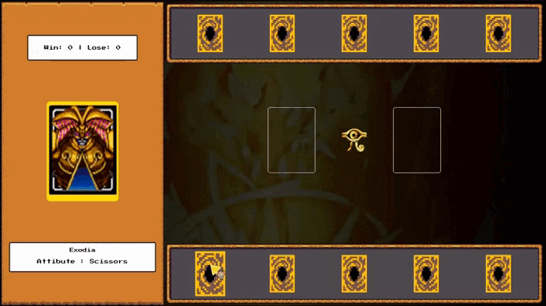

<h1 align="center"> Desafio da DIO - Jogo de Cartas do Yu-Gi-Oh!</h1>

 

  

## 🚀 Tecnologias

Esse projeto foi desenvolvido com as seguintes tecnologias:

- HTML, CSS e JavaScript
- Git e Github

## 💻 Projeto

Um Jogo de Cartas do Yu-Gi-Oh!

- [Para ver no site](https://lupyeah.github.io/Yugioh/)

## 📋 Funcionalidades

- 📌 Um jogo estilo pedra, papel e tesoura com o tema de Yu-Gi-Oh!
---
